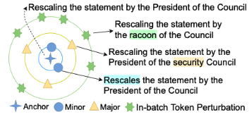

<!-- more -->

Paper：<https://aclanthology.org/2023.acl-long.283.pdf>

Github: <https://github.com/xu1998hz/SEScore2>

## Understanding how to apply SEScore to a translation model

**Natural Language Processing** (NLP) is a field that focuses on creating methods to allow computers to perform tasks involving human language. While this sounds easy as a human, it is challenging for computers and often requires large amounts of data. In particular, this data is made up of input output pairs, where the model is trained to recreate the proper output from the given output. The question then arises – how do we measure the model’s ability to generate the correct output? 

## Why A New Evaluation Metric?

Traditionally, models are evaluated using untrained n-gram techniques, or techniques that count the number of overlapping character (or word) sequences between two samples. A popular example of this is BLEU[2] scores, a.k.a. Bilingual Evaluation Understudy score, which calculates the percentage of overlapping subsequences of varying lengths and averages the result to provide an outcome. This technique has two primary disadvantages, despite its ease of implementation: it cannot disambiguate between different degrees of “incorrectness” and it is not necessarily highly correlated with human ratings, especially as models become better-performing.

Newer techniques involve using trained metrics, such as **BLEURT**[3] and **COMET**[4]. Both of these metrics are trained on human judgements and rely on large pre-trained models, which is not necessarily available for all languages and domains. While these do outperform more traditional techniques with regards to human annotator correlation, they are still limited by their need to collected training data.

**SEScore2**[1] is unique in its lack of reliance on human annotations for training while still providing a more accurate measure (with regards to agreement with human annotators) than older methods. 

## Generating Synthetic Samples for Evaluation

How does SEScore2 work? SEScore2, like many of the other trained metrics, is first initialized with pretrained embeddings. Then, rather than training on human evaluations, it is instead trained with a task-agnostic generation objective on large-scale synthetic data. From there, no finetuning is needed before applying it for evaluation. The issue then instead becomes, how do we generate synthetic samples for evaluation?

Older techniques for generating synthetic **negative hypotheses**, or incorrect examples to train our evaluation metric with, involve randomly replacing or sampling from the tokens present in the vocabulary. While the resulting options are undoubtably incorrect they are not incorrect in the manner that modern text generation models tend to be. Modern LLMs do not accidentally mix up the words “president” and “racoon,” but they do hallucinate information based on trends in the training data. 

What SEScore2 does is generate incorrect samples by sampling from the k nearest neighbors of each token. The algorithm is careful to not always use the first nearest neighbor, since sometimes that returns a syntactically slightly different sentence that captures the same semantic meaning, which is still correct. Instead, a random sample is taken and the edit distance between the sample and the correct form is decomposed using an edit distance algorithm. Since most modern models make fewer than five errors per output, up to five random perturbation are made to the correct form, pulling from the mentioned decomposition mentioned. The resulting synthetic samples are contextually valid by have semantic or syntactic deviations from the reference.  

## Effectiveness of SEScore2

The authors conduct several experiments to demonstrate the the superior performance and generalizability of the SEScore2 metric across various domains and text generation tasks. More specifically, they assess the metric by i) validating the trained SEScore2 checkpoint scores over a range of Natural Language Generation (NLG) tasks such as Machine Translation, Speech Translation, Data-to-Text, and Dialogue Generation; ii) testing over multiple non-English to English translations, iii) testing over two WMT domains – News and TED, and iv) performing a comprehensive set of evaluations to gather a more nuanced understanding of the metric’s performance over different dimensions. For the text generation tasks, the SEScore2 metric is compared with n-gram and distance-based metrics such as BLEU[2], ChrF[5] and TER[6], unsupervised learned metrics such as PRISM[7], SEScore[8], BARTScore[9] and BERTScore[10], and the best performing metrics learned in a supervised manner such as COMET[4] and BLEURT[3]. Evaluation is done by computing how correlated the metric output scores are to human scores on the same input.

Refer to the above figure for all the following demonstrations of the effectiveness of SEScore2.

## Overall Performance Comparison

The figure above shows the overall performance across a range of NLG tasks described above. SEScore2 is shown to have superior performance compared to the best rule based metric ChrF by a correlation score improvement of 0.145, and the top unsupervised metrics, including PRISM, by a margin of 0.078 in terms of Kendall correlation​​. Even more notable is that SEScore2 is demonstrated to be better than the supervised BLEURT on two out of four NLG tasks.

## Performance across NLG tasks

SEScore2 is compared with the baselines on various tasks, including machine translation (MT), data-to-text (D2T), and dialogue generation. The following are some specific observation that can be drawn from table/figure. 
- In all three language directions tested (English-German, German-English, and Chinese-English), SEScore2 consistently outperformed unsupervised metrics and even excelled over supervised metrics COMET and BLEURT in Chinese-English translations​​.
- SEScore2 led the field in speech translation, notably outperforming all metrics, including COMET. 
- SEScore2 also excelled in data-to-text and dialogue generation tasks, surpassing both supervised and unsupervised metrics​​.
These results clearly illustrate SEScore2's versatility and effectiveness across different text generation tasks​​.

## Diverse Domains and Languages

In addition to excelling in various text generation tasks, SEScore2 also demonstrates remarkable consistency in translation tasks into the same target languages. Specifically, in machine translation tasks like Chinese to English and German to English, SEScore2 outshines all unsupervised metrics and surpasses supervised metrics BLEURT and COMET in Chinese to English. Although slightly behind BLEURT in German to English, it remains competitive with COMET.

The authors evaluate the impact of domain shift on the metric performance with a focus on the News and TED WMT domains. While all metrics trained on News show a decline in performance in the TED domain, known for its informal and disfluent language styles, SEScore2 exhibits the least decline among learned metrics. This resilience to domain shifts, coupled with its ability to remain consistent across many to same-language translation tasks highlights SEScore2's adaptability and robustness across varied domains and languages.

## Evaluating SEScore2 reveals its strengths across multiple dimensions:

- Data Scaling: Even with 1 million data points, SEScore2 shows notable improvements, indicating efficiency in training and adaptability to general domains.
- Fine-tuning Risks: Contrary to expectations, fine-tuning SEScore2 on specific domains may hinder its generalizability.
- Retrieval Augmented Synthesis vs. Random Sampling: The former significantly enhances SEScore2's effectiveness over the latter.
- Ablation on RA Operations: Insert/replace operations are crucial for creating realistic synthetic sentences and boosting performance.
- Effects of Severity Measures: Both IDF and XLM-based measures substantially improve SEScore2's performance, showcasing their importance in accuracy enhancement across domains.

## Interpreting SEScore2:

SEScore2 excels in multi-dimensional evaluations of text generation. In benchmarks like WebNLG[11] and BAGEL, it achieves the highest Kendall correlation in various aspects, notably fluency, text structure, naturalness, and overall quality, surpassing BLEURT significantly. This indicates that while SEScore2 provides an overall score, it is particularly effective in assessing quality and fluency aspects.

## Summary
SEScore2 is an evaluation metric for text generation that offers a notable advancement by effectively utilizing synthetic data samples for assessment, bypassing the need for extensive human-labeled data. The metric has demonstrated effectiveness across diverse Natural Language Generation tasks, showing improved performance over traditional metrics and some state-of-the-art supervised approaches in multiple languages and domains. It particularly excels in evaluating fluency and quality. SEScore2's robustness is further exemplified through ablation studies, revealing the importance of retrieval-augmented synthesis and severity measures in its design. The paper positions SEScore2 as a reliable and comprehensive tool for the evaluation of text generation systems.

## References

[1] Xu, W., Qian, X., Wang, M., Li, L., & Wang, W. Y. (2023, July). SESCORE2: Learning text generation evaluation via synthesizing realistic mistakes. In Proceedings of the 61st Annual Meeting of the Association for Computational Linguistics (Volume 1: Long Papers) (pp. 5166-5183).
[2] Papineni, K., Roukos, S., Ward, T., & Zhu, W. J. (2002, July). Bleu: a method for automatic evaluation of machine translation. In Proceedings of the 40th annual meeting of the Association for Computational Linguistics (pp. 311-318).
[3] Sellam, T., Das, D., & Parikh, A. P. (2020). BLEURT: Learning robust metrics for text generation. arXiv preprint arXiv:2004.04696.
[4] Rei, R., Stewart, C., Farinha, A. C., & Lavie, A. (2020). COMET: A neural framework for MT evaluation. arXiv preprint arXiv:2009.09025.
[5] Popović, M. (2015, September). chrF: character n-gram F-score for automatic MT evaluation. In Proceedings of the tenth workshop on statistical machine translation (pp. 392-395).
[6] Snover, M., Dorr, B., Schwartz, R., Micciulla, L., & Makhoul, J. (2006). A study of translation edit rate with targeted human annotation. In Proceedings of the 7th Conference of the Association for Machine Translation in the Americas: Technical Papers (pp. 223-231).
[7] Thompson, B., & Post, M. (2020). Automatic machine translation evaluation in many languages via zero-shot paraphrasing. arXiv preprint arXiv:2004.14564.
[8] Xu, W., Tuan, Y., Lu, Y., Saxon, M., Li, L., & Wang, W. Y. (2022). Not all errors are equal: Learning text generation metrics using stratified error synthesis. arXiv preprint arXiv:2210.05035.
[9] Yuan, W., Neubig, G., & Liu, P. (2021). Bartscore: Evaluating generated text as text generation. Advances in Neural Information Processing Systems, 34, 27263-27277.
[10] Zhang, T., Kishore, V., Wu, F., Weinberger, K. Q., & Artzi, Y. (2019). Bertscore: Evaluating text generation with bert. arXiv preprint arXiv:1904.09675.
[11] Gardent, C., Shimorina, A., Narayan, S., & Perez-Beltrachini, L. (2017, September). The WebNLG challenge: Generating text from RDF data. In Proceedings of the 10th International Conference on Natural Language Generation (pp. 124-133).

